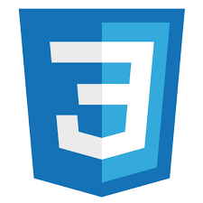

# Lenguajes de Marcas y Sistemas de Gestión de la Información

## Actividad 1

### Equipo de trabajo:

    • Silvia Arnaiz García
    • José Antonio Guardiola Cuadrado
    • María Jesús Sagra Montero

### Ruta del [repositorio](https://github.com/sarnaizgarcia/LenguajesDeMarcasActividad1): https://github.com/sarnaizgarcia/LenguajesDeMarcasActividad1

### Reparto de tareas:

    • Formulario de contacto – Silvia Arnaiz
    • Índex – José Antonio Guardiola
    • Quienes somos – María Jesús Sagra Montero
    • CSS Y JAVASCRIPT – En conjunto

